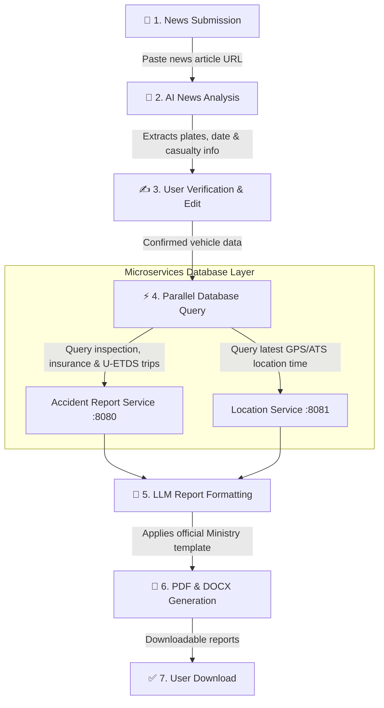

# UAB AI-Generated Accident Report System 

An end-to-end, multi-tier microservices platform designed for the **Republic of Türkiye Ministry of Transport and Infrastructure (UAB)**. The system automates the processing of bus accident news, cross-references internal government databases, and generates standardized official incident briefing notes (*Bilgi Notu*) in PDF and DOCX formats.

---

## 🎯 Overview & Problem Statement

When a public transportation accident occurs, ministry officials need immediate, accurate, and standardized reporting. Manually extracting accident details from news articles, cross-referencing multiple ministerial databases (vehicle registration, technical inspection, insurance, U-ETDS passenger/trip lists, and ATS GPS tracking), and authoring formal administrative briefing notes is time-consuming and error-prone.

This platform automates the entire workflow into a seamless 4-step pipeline powered by modern microservices and Large Language Models (LLM).

---

## 🔄 End-to-End Workflow Pipeline



---

## 🏛 System Architecture & Service Modules

The repository is organized into four independent, decoupled services:

```text
UAB-AIGeneratedReport/
├── frontend/                     # Next.js 16 (App Router) + React 19 + TailwindCSS
├── ai-service/                   # FastAPI + Qwen LLM Orchestration + Document Engine
└── backend/
    ├── accident-report-service/  # Spring Boot 4 + JDBC (kaza_kirim_rapor DB function)
    └── location-service/         # Spring Boot 4 + JDBC (ATS location tracking query)
```

### Service Breakdown:

| Service | Port | Tech Stack | Responsibilities |
| :--- | :---: | :--- | :--- |
| **Frontend** | `3000` | Next.js 16, React 19, TailwindCSS, Shadcn UI | User interface for URL submission, plate/date verification table, and report download management. |
| **AI Orchestrator** | `8000` | Python 3.10+, FastAPI, WeasyPrint, python-docx | Web scraping, LLM prompt orchestration, business logic, and formal PDF/Word document generation. |
| **Accident Report Service** | `8080` | Java 25, Spring Boot 4, PostgreSQL, JDBC | Queries vehicle ownership, inspection dates, seat/traffic insurance status, and U-ETDS trip/passenger manifests. |
| **Location Service** | `8081` | Java 25, Spring Boot 4, PostgreSQL, JDBC | Queries the vehicle's last transmitted GPS/ATS tracking timestamp. |

---

## 📄 Generated Document Standards

The generated documents strictly comply with Republic of Türkiye official administrative correspondence guidelines:
- **Header:** High-resolution official ministry logo with "BİLGİ NOTU" heading.
- **Metadata Section:** Subject, license plate, vehicle model, capacity, and date.
- **Body & Findings:** Standardized bullet points (`➢`) detailing registration, active technical inspection, insurance status, U-ETDS passenger & driver records, and ATS location verification.
- **Closing:** Standard Turkish administrative sign-off (*"tespit edilmiştir. / Arz ederim."*).

---

## 🚀 Quick Start Guide

### Prerequisites
- **Java 25** & Maven (or included `mvnw`)
- **Python 3.10+**
- **Node.js 20+** & npm
- **PostgreSQL Database** access

---

### Step 1: Start Backend Services (Spring Boot)

1. **Accident Report Service (`port: 8080`):**
   ```bash
   cd backend/accident-report-service
   cp .env.example .env
   # Update DB_URL, DB_USERNAME, DB_PASSWORD in .env
   ./mvnw spring-boot:run
   ```

2. **Location Service (`port: 8081`):**
   ```bash
   cd backend/location-service
   cp .env.example .env
   # Update DB_URL, DB_USERNAME, DB_PASSWORD in .env
   ./mvnw spring-boot:run
   ```

---

### Step 2: Start AI Service (FastAPI)

```bash
cd ai-service
python3 -m venv venv
source venv/bin/activate    # On Windows: venv\Scripts\activate
pip install -r requirements.txt
python ReportService.py
```
> The AI service runs on `http://localhost:8000`. API documentation is available at `http://localhost:8000/docs`.

---

### Step 3: Start Frontend (Next.js)

```bash
cd frontend
npm install
npm run dev
```
> Access the web application at `http://localhost:3000`.

---

## 🔒 Security & Best Practices
- **Environment Isolation:** Sensitive database credentials and API endpoints are loaded via `.env` files and excluded from version control.
- **Microservices Decoupling:** Each layer functions independently with dedicated ports and failure boundaries.
- **Fail-Safe Processing:** If a vehicle's license plate or date is missing in the news text, the system leaves clear placeholders for manual user editing before database queries are triggered.
